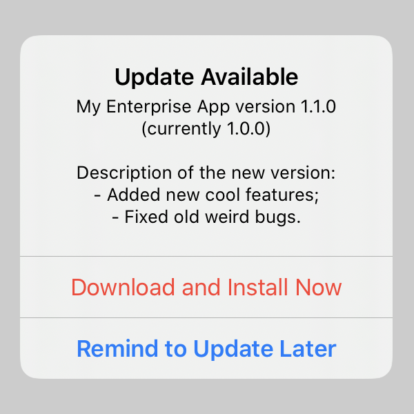

# EnterpriseAppUpdater
Enterprise App Updater loads app's manifest file, checks for a new version, provides an alert with patch notes and starts the update.



## Setup
### Swift Package Manager *(preferred)*
Open your application project in Xcode 11 or later, go to menu `File -> Swift Packages -> Add Package Dependency...` and paste the package repository URL `https://github.com/DnV1eX/EnterpriseAppUpdater.git`.

### CocoaPods *(deprecated)*
Add the pod to your `Podfile`:
```ruby
pod 'EnterpriseAppUpdater', '~> 1.1'
```

### Copy File *(not recommended)*
Alternatively, you can manually copy [EnterpriseAppUpdater.swift](Sources/EnterpriseAppUpdater/EnterpriseAppUpdater.swift) into your project.

## Prepare Application Manifest
1. Generate `manifest.plist` during enterprise app distribution in Xcode Organizer;
2. Make sure `software-package` asset contains direct **https** link to the app's **.ipa**;
3. Optionally add release notes to `subtitle` metadata to display in the update alert *(use `\n` for line break)*;
4. Upload the manifest and get a direct **https** link you will use to initialize EnterpriseAppUpdater.
> Manifest URL must remain the same when the update is released, you only edit **.plist** content such as app `url`, `bundle-version` and optional `subtitle`.

## Usage Example
```swift
import EnterpriseAppUpdater
typealias Updater = EnterpriseAppUpdater
```
```swift
let updater = Updater(manifest: url) // Initialize EnterpriseAppUpdater with manifest.plist URL.
updater.loadManifest { result in
    switch result {
    case .success(let manifest):
        switch updater.check(manifest: manifest) {
        case .success(let item):
            let alert = updater.alert(for: item, onStart: { _ in
                print(Updater.Message.started, item.metadata.version)
                updater.start { error in
                    print(Updater.Message.error, error)
                }
            }, onPostpone: { _ in
                print(Updater.Message.postponed, item.metadata.version)
            })
            self.present(alert, animated: true) // Use UIApplication.shared.windows.first?.rootViewController? if self is not UIViewController.
        case .failure(let error):
            switch error {
            case .noAppUpdateNeeded:
                print(Updater.Message.upToDate, error)
            default:
                print(Updater.Message.error, error)
            }
        }
    case .failure(let error):
        print(Updater.Message.error, error)
    }
}
```
> It's up to you whether to load manifest and check for update on the app launch, at time intervals, or by user request.

## License
Copyright © 2019 DnV1eX. All rights reserved.
Licensed under the Apache License, Version 2.0.
